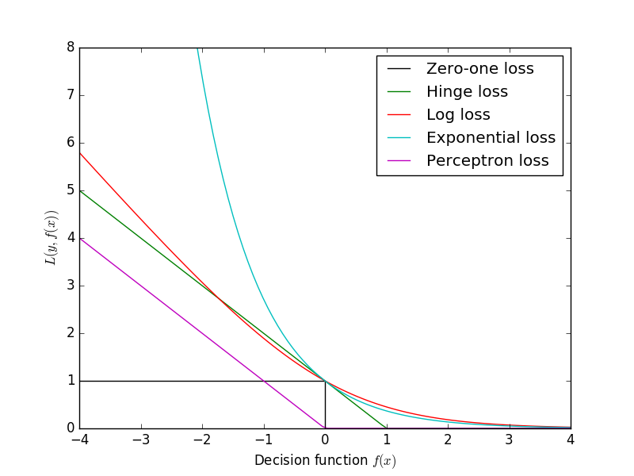
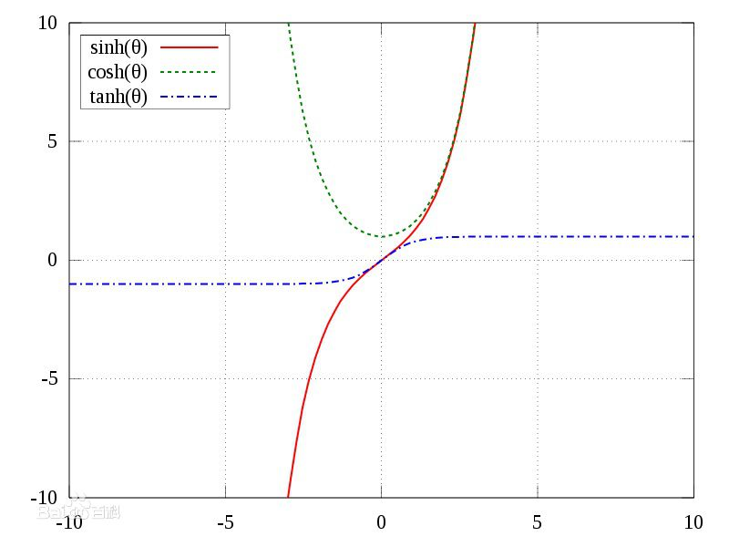
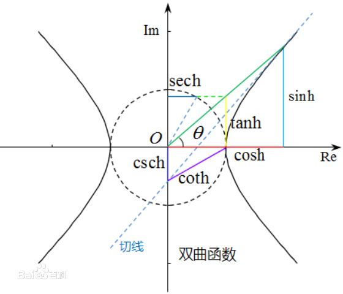
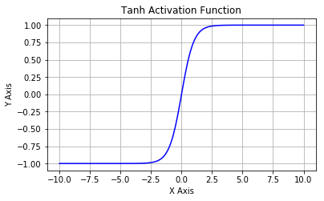
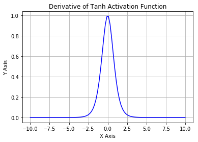
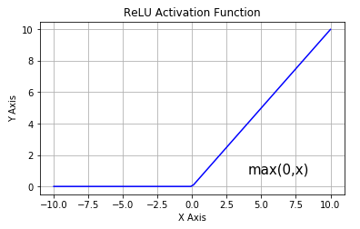
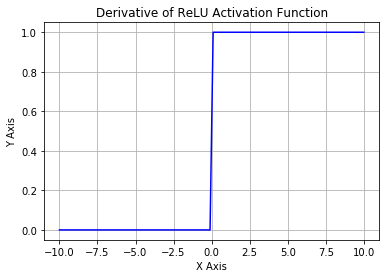
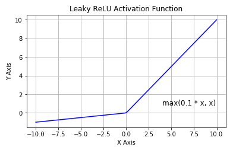
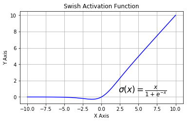
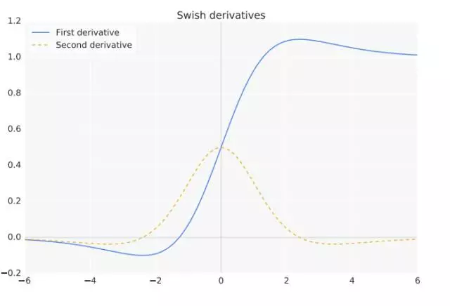

# 机器学习损失函数
#### 原创 by 朱一搏(zhuyibo@yuewen.com)
通常，监督学习的优化目标函数（或者叫代价函数）形式如下[^1]：
$$
\theta^* = \arg \min_\theta (\frac{1}{N}\sum_{i=1}^{N} L(y_i, f(x_i; \theta)) + \lambda\  \Omega(\theta) ) \quad \tag{1}
$$
即学习到使得右边式子达到最小值的参数$\theta$的解$\theta^*$。其中，前面部分$L(y_i, f(x_i; \theta))$是第$i$个样本的预测值$f(x_i; \theta)$和真实值$y_i$之间的误差，也即损失函数[^2]。后面的$\Omega(\theta)$是对参数$\theta$的正则化项或者惩罚项，主要用来降低模型的复杂度，避免过拟合。损失函数 *L* 也被称为经验风险，加上正则项后就是结构风险[^3]。我们令$\hat{y_i}=f(x_i; \theta)$，下面分别看一下分类问题和回归问题中的一些常见损失函数。为了简化表示，略去代表第$i$个样本的下标$i$。

## 分类问题
### 1. 0-1损失[^4]
$$
L(y, \hat{y})=\left\{
\begin{aligned}
1, \quad y \neq \hat{y}\\
0, \quad y=\hat{y}
\end{aligned}
\right.
$$
如果是二分类问题，则等价于判断$y$和$\hat{y}$的符号是否相同：
$$
L(y, \hat{y})=\left\{
\begin{aligned}
1, \quad y\hat{y}\le0\\
0, \quad y\hat{y}>0
\end{aligned}
\right.
$$
此时亦等价于[^5]：
$$
L(y, \hat{y})=\frac{1}{2}(1-sign(y\hat{y}))
$$
该损失函数能够直观地刻画分类的错误率，但是非凸、非光滑的特点，在算法上难以优化，0-1损失的一个代理损失函数是Hinge损失函数[^6]。
### 2. Hinge loss
Hinge loss和SVM息息相关[^7]，具体公式如下：
$$
L(y, \hat{y})=max(0, 1-y\hat{y}), \quad y=\pm1
$$
可见，当真实值$y$和预测值$\hat{y}$符号相同时，并且$y\hat{y}\ge1$时，Hinge loss为0；当$y$和$\hat{y}$符号相反时，Hinge loss随着$\hat{y}$的增大而线性增大[^8]。
另外，Hinge loss在$y\hat{y}=1$处不可导，因此不能用梯度下降法进行优化，而是用次梯度下降法(Subgradient Descent Method)[^9]。

### 3. 指数损失Exponential loss[^10]
指数损失函数也是0-1损失函数的一种代理函数：
$$
L(y, \hat{y})=\exp(-y\hat{y})
$$
运用指数损失的典型分类器是AdaBoost算法。

### 4. Logistic损失(log loss)
我们先来看一下Logistic函数。
$$
\begin{gathered}
\sigma(z) = sigmoid(z) = \frac{1}{1+\exp(-z)} \\
\sigma(-z) = 1 - \sigma(z) \tag{4.0}
\end{gathered}
$$
其函数图像：  

在$y\in\{-1,1\}$时，log loss形式为：[^9] [^11]
$$
L(y, \hat{y})=\log(1+\exp(-y\hat{y})), \quad y=\pm1 \tag{4.1} 
$$
**注意，其中 $\hat{y}=f(x; \theta)=\theta^\mathrm{T}x$**

在$y\in\{0,1\}$时，log loss形式为：[^12] [^13]
$$
L(y, \hat{y})=-(y\log\sigma(\hat{y})+(1-y)\log(1-\sigma(\hat{y}))), \quad y=0,1 \tag{4.2}
$$
如果我们调整一下 $\hat{y}$ 的定义：$\hat{y}=\sigma(f(x;\theta))=\sigma(\theta^\mathrm{T}x)$，此时其形式就变为我们熟悉的二元交叉熵形式[^14]：
$$
L(y, \hat{y})=-(y\log\hat{y}+(1-y)\log(1-\hat{y})), \quad y=0,1 \tag{4.3}
$$

式$(4.1)$、式$(4.2)$和式$(4.3)$等价，我们来看一下$(4.1)$和$(4.2)$式等价的推导过程。
$(4.1)$式中$y=1$时$(4.2)$式中也有$y=1$, $(4.1)$式化简为：
$$
\begin{aligned}
L(y, \hat{y})=L(1, \hat{y}) &= \log(1+\exp(-\hat{y})) \\
&= -\log\sigma(\hat{y}) \\
&= -\log\sigma(\theta^\mathrm{T}x)
\end{aligned}
$$
$(4.2)$式化简为：
$$
\begin{aligned}
L(y, \hat{y})=L(1, \hat{y}) &= -\log\sigma(\hat{y}) \\
&= -\log\sigma(\theta^\mathrm{T}x)
\end{aligned}
$$
可见当$y$取标签1（正例）时，$(4.1)$和$(4.2)$式相等。
再看当$y$取负例时，此时$(4.1)$式中$y=-1$，$(4.2)$式中$y=0$。$(4.1)$式化简为：
$$
\begin{aligned}
L(y, \hat{y})=L(-1, \hat{y}) &= \log(1+\exp(\hat{y})) \\
&= -\log(\frac{1}{1+\exp(\hat{y})}) \\
&= -\log(\sigma(-\hat{y})) \\
&= -\log(1-\sigma(\hat{y})) \\
&= -\log(1-\sigma(\theta^\mathrm{T}x)) 
\end{aligned}
$$
最后一步是因为$(4.0)$式$\sigma(-z)=1-\sigma(z)$。$(4.2)$式化简为：
$$
\begin{aligned}
L(y, \hat{y})=L(0, \hat{y}) &= -\log(1-\sigma(\hat{y})) \\
&= -\log(1-\sigma(\theta^\mathrm{T}x)) 
\end{aligned}
$$
因此当$y$取负例时$(4.1)$和$(4.2)$式相等，综合起来就是两者等价。
我们现在再来推导一下这个损失函数的由来。
对于$n$个服从i.i.d.分布（独立同分布）的样本$\{x_i,y_i\}$, $x_i$是输入特征向量，$y_i$是真实分类标签并且$y_i\in\{0,1\}$。设随机变量$X$代表输入$x$，随机变量$Y$代表类别标签$y$，我们试图寻找出具体的联合分布$P(X,Y)$以及条件分布$P(Y|X)$（或者连续值情况下的概率密度函数），但是因为我们无法获得所有的样本，输入的复杂性等等原因，我们很难求解没有给出具体分布函数形式的非参数统计(nonparametric)问题。另一方面，我们可以基于经验、数据生成的方式或中心极限定理来猜测具体的分布形式（比如正态分布、0-1伯努利分布、二项分布、泊松分布等），一旦我们做出分布假定，就可以用一组参数$\theta$来确定该分布，所以问题就转为对这组参数$\theta$的估计，也即“分布已知，参数未知”的参数统计(parametric)问题。最大似然估计(maximum-likelihood estimation,MLE)就是其中一种参数估计方法（还有最小方差无偏估计、贝叶斯估计等方法）[^15]。
最大似然的意思就是最为相似，即最大的可能性。对于获得的服从i.i.d.的$n$个样本$\{x_i,y_i\}$，我们假定样本服从某种分布，
找到使以下概率最大化（使该样本结果出现的可能性最大）的参数$\theta$就是最大似然估计：
$$
\arg \max_\theta P(y_1,\cdots,y_n|x_1,\cdots,x_n;\theta)
$$
因为样本服从i.i.d.，所以等价于：
$$
\arg \max_\theta \prod_{i=1}^{n}P(y_i|x_i;\theta)
$$
连续相乘比较复杂，为了简化计算，我们对优化目标取对数$\log$（一般取自然对数$\ln$或者$\log_2$)，因为$\log$严格单调递增，并不影响结果：
$$
\begin{gathered}
L(\theta)=\prod_{i=1}^{n}P(y_i|x_i;\theta)  \\
l(\theta)=\log L(\theta) = \sum_{i=1}^{n}\log P(y_i|x_i;\theta) \quad \tag{4.4}
\end{gathered}
$$
最大化$L(\theta)$和最大化$l(\theta)$是等价的，但是$l(\theta)$是求和计算，简单多了。在逻辑回归二元分类任务中，分类标签$y\in\{0,1\}$，因此我们可以认为数据服从0-1伯努利分布：
$$
y \sim Bernoulli(1,p)
$$
即对于每一个样本的分类标签$y$，为1（正例）的概率$p$，为0（反例）的概率则为$1-p$。因此：
$$
\begin{gathered}
P(y=1|x;\theta)=h_\theta(x) \\
P(y=0|x;\theta)=1-h_\theta(x)
\end{gathered}
$$
上面两个公式可以合并成一个公式：
$$
P(y|x;\theta)=(h_\theta(x))^y*(1-h_\theta(x))^{1-y}
$$
代入到$(4.4)$式中，得：
$$
\begin{aligned}
l(\theta)&=\sum_{i=1}^{n}\log (h_\theta(x_i))^{y_i} * (1-h_\theta(x_i))^{1-y_i} \\
&= \sum_{i=1}^{n}(y_i\log h_\theta(x_i) + (1-y_i)\log (1-h_\theta(x_i))) \quad \tag{4.5}
\end{aligned}
$$
最大化$l(\theta)$相当于最小化$-l(\theta)$，而$h_\theta(x)=\sigma(\theta^\mathrm{T}x)=\hat{y}$，因此$(4.5)$式等价于最小化：
$$
\begin{aligned}
-\sum_{i=1}^{n}(y_i\log \hat{y_i}+(1-y_i)\log (1-\hat{y_i}))
\end{aligned}
$$
最后除以样本的数量$n$，得到平均到每个样本的平均损失使结果更直观：
$$
-\frac{1}{n}\sum_{i=1}^{n}(y_i\log \hat{y_i}+(1-y_i)\log (1-\hat{y_i}))
$$
对于单个样本（去掉下标）损失函数则是：
$$
L(y, \hat{y})=-(y\log \hat{y}+(1-y)\log (1-\hat{y})), \quad y=0,1
$$
这正是$(4.3)$式。至此，log loss的由来推导完毕。

### 5. 交叉熵损失(Cross Entropy)
交叉熵来自于KL散度（Kullback-Leibler (KL) divergence，KL散度也叫相对熵），主要用来度量两个分布的差异，交叉熵越小，差异越小，分布越相似。其形式如下：
$$
L(y, \hat{y})=-\sum_{j=1}^{m}y^j\log \hat{y}^j
$$
注意$y^j,\hat{y}^j$分别表示在$m$类中第$j$类的真实值和预测值，一个样本只能属于$m$个类别中的一个，也就是说这是一个多分类情况下的公式。如果在把$n$个样本考虑进来则损失函数变为：
$$
-\frac{1}{n}\sum_{i=1}^{n}\sum_{j=1}^{m}y_{i}^j\log \hat{y_{i}}^j
$$
可见，包括从上面第4节log loss的介绍中我们也已经发现，log loss其实是交叉熵损失在二分类情况下的一个特例。
因为只能属于$m$个类别中的1个，也就是真实标签$y_{ij},j\in\{1,\cdots,m\}$只能有一个值为1，其它都是0，因此可以化简为：
$$
-\frac{1}{n}\sum_{i=1}^{n} \log \hat{y_{i}}^{(j)}
$$
其中，$\hat{y_{i}}^{(j)}$表示第$i$个样本真实标签值为1的第$(j)$个分类的预测概率。
对于多分类问题，深度学习神经网络的最后一层通常会加一层softmax层来计算预测概率：
$$
\begin{gathered}
z_i = f(x_i; \theta) \\
\hat{y_i} = softmax(z_i) = \frac{\exp(z_i)}{\sum_{j=1}^{m}\exp(z_j)}, \quad i=1,\cdots,m
\end{gathered}
$$
因此多分类交叉熵经常和softmax函数结合使用。

#### 以上一些损失函数曲线对比如下图：

## 回归问题，大多数参考[^16][^17][^18]
假设：  
真实值：$y=\{y_1,y_2,\ldots,y_n\}$  
预测值：$\hat{y}=\{\hat{y_1}\,\hat{y_2},\ldots,\hat{y_n}\}$  
### 1、平方损失（也叫L2损失），或者均方误差MSE(Mean Square Error)
$$
L(y,\hat{y}) = \frac{1}{2}(y-\hat{y})^2
$$
其中乘以$\frac{1}{2}$是为了求导时去掉系数。平方损失主要用于均值回归，其函数光滑处处可导，可以用梯度下降法进行优化。然而，当预测值距离真实值越远，平方损失惩罚力度就越大，对异常点很敏感。在训练时，会赋予异常样本更大的权重，以牺牲其它样本的误差为代价，朝着减小异常点误差的方向更新，这样就会降低模型的整体性能。
  
当用于预测结果评估指标时，则是大家熟悉的MSE指标：
$$
MSE = \frac{1}{n}\sum_{i=1}^{n}(y_i-\hat{y_i})^2
$$
范围$[0,+\infty)$，当预测值与真实值完全吻合时等于0，即完美模型；误差越大，该值越大。
### 2、均方根误差RMSE(Root Mean Square Error)
对MSE加个根号运算就是RMSE，这样数量级上比较直观，可以和$y,\hat{y}$值在同一根轴上进行比较。
$$
RMSE = \sqrt{\frac{1}{n}\sum_{i=1}^{n}(y_i-\hat{y_i})^2}
$$
同MSE一样，如果实际问题中，如果存在个别偏离程度非常大的离群点（Outlier）时，即使离群点数量非常少，也会让MSE和RMSE指标变得很差。突发事件通常会带来不少离群点。
### 3、绝对损失（也叫L1损失），或者平均绝对误差MAE(Mean Absolute Error)
$$
L(y,\hat{y}) = |y-\hat{y}|
$$
绝对损失相当于是在做中值回归，相对于平方损失而言，对异常点更鲁棒一些。但是，绝对损失在0点($y=\hat{y}$)时不可导，此时无法使用梯度下降算法。更严重的是，绝对损失在非0点的梯度始终相同，即使是很小的损失梯度也很大，这样不利于模型的学习（不过也有解决方法，就是在损失接近0时降低学习率，也就是采用变化的学习率）。而平方损失的梯度随着损失的增大而增大，在损失靠近0时则梯度也会随之减小，这样在训练结束时模型就会收敛到更精确的结果。
如果异常点代表在商业中很重要的异常情况，并且需要被检测出来，则应选用平方损失函数。相反，如果只把异常值当作受损数据，则应选用绝对损失函数。
  
当用于预测结果评估指标时，则是大家熟悉的MAE指标：
$$
MAE = \frac{1}{n}\sum_{i=1}^{n}|\hat{y_i}-y_i|
$$
MAE对于离群点的处理比RMSE要稳定一点，因为平方相对于绝对值会放大差异。
### 4、平均绝对百分比误差MAPE(Mean Absolute Percentage Error)
$$
MAPE = \frac{100\%}{n}\sum_{i=1}^{n}\left|\frac{\hat{y_i}-y_i}{y_i}\right|
$$
MAPE把每个点的误差进行了归一化，降低了离群点带来的绝对误差的影响。但是注意当真实值有数据等于0时，存在分母为0公式不能用的问题。
### 5、对称平均绝对百分比误差SMAPE(Symmetric Mean Absolute Percentage Error)
$$
SMAPE = \frac{100\%}{n}\sum_{i=1}^{n}\frac{|\hat{y_i}-y_i|}{(|\hat{y_i}|+|{y_i}|)/2}
$$
SMAPE也把每个点的误差进行了归一化，也要注意当真实值和预测值都等于0时，存在分母为0公式不能用的问题。
### 6、Huber损失
$$
L(y, \hat{y})=\left\{
\begin{aligned}
\frac{1}{2}(y-\hat{y})^2, \quad |y-\hat{y}|\le\delta\\
\delta|y-\hat{y}|-\frac{1}{2}\delta^2, \quad |y-\hat{y}|>\delta
\end{aligned}
\right.
$$
其中$\delta$是大于0的超参数。可见，当绝对误差$|y-\hat{y}|$在$[-\delta,\delta]$之间时，Huber损失等价于平方损失；在$(-\infty,\delta)$或$(\delta,+\infty)$时，等价于绝对损失。因此$\delta$的选择很重要，这决定你如何定义异常点，决定何时采用绝对损失，何时采用平方损失。
Huber损失结合了平方损失和绝对损失的优点，但是需要不断的实验以确定比较好的超参$\delta$。
### 7、Log-Cosh损失
$$
L(y,\hat{y})=\log(\cosh(y-\hat{y}))
$$
$\cosh$是双曲余弦函数。该损失函数二阶可导，且比平方损失更光滑，它也具有Huber损失的所有优点。缺点是当误差很大时，一阶导数和Hessian矩阵会变成定值，会导致XGBoost中出现的缺少分裂点类似的问题。

这里再介绍一下双曲函数 [^19]。
双曲正弦：$\sinh(x)=\frac{e^x-e^{-x}}{2}$  
双曲余弦：$\cosh(x)=\frac{e^x+e^{-x}}{2}$  
双曲正切：$\tanh(x)=\frac{\sinh(x)}{\cosh(x)}=\frac{e^x-e^{-x}}{e^x+e^{-x}}$  
双曲余切：$\coth(x)=\frac{1}{\tanh(x)}=\frac{e^x+e^{-x}}{e^x-e^{-x}}$  
双曲正割：$sech(x)=\frac{1}{\cosh(x)}=\frac{2}{e^x+e^{-x}}$  
双曲余割：$csch(x)=\frac{1}{\sinh(x)}=\frac{2}{e^x-e^{-x}}$  

### 8、分位数损失[^20]
$$
L(y,\hat{y})=\sum_{i:y_i<\hat{y_i}}(1-\gamma)|y_i-\hat{y_i}|+\sum_{i:y_i\geq\hat{y_i}}\gamma|y_i-\hat{y_i}|
$$
$\gamma\in(0,1)$就是所需的超参分位数。$\gamma$等于0.5时就是绝对误差MAE。分位数损失用于预测范围，而不是单值。设置多个$\gamma$值，得到多个预测模型，然后绘制成图表，即可知道预测范围及对应概率(两个$\gamma$值相减)。

# 深度学习激活函数 [^21]
对于深度神经网络，需要在每一层线性变换后叠加一个非线性激活函数，以避免多层神经网络等效于单层线性函数，增加模型的非线性拟合能力，解决真实世界中线性不可分问题。
激活函数也用于将神经网络的输出压缩到特定边界内，对于神经元的输出值$w^\mathrm{T}x+b$可能非常大，如果直接传给下一层，又会被放大，从而导致计算复杂消耗算力[^22]。

### 1、对数几率Sigmoid
Sigmoid激活函数形式为：
$$
f(z)=\frac{1}{1+e^{-z}}
$$

其导数为：
$$
f'(z)=f(z)(1-f(z))
$$

Sigmoid主要有如下几个问题：  
* Sigmoid将输入$z$映射到区间$(0,1)$，当$z$很大时，$f(z)$趋近于1，$z$很小时，$f(z)$趋近于0，而此时其导数都会趋近于0，从而导致梯度消失的现象：神经元饱和，权重不会更新，与之相连的神经元的权重也更新很慢，反向传播几乎无法执行；
* 不以0为中心（zero-centered）；
* 幂运算$exp()$函数计算成本比较高。

### 2、双曲正切Tanh
Tanh激活函数形式为：
$$
f(z)=\tanh(z)=\frac{e^z-e^z}{e^z+e^z}
$$

其导数为：
$$
f'(z)=1-(f(z))^2
$$

可以发现：
$$
\tanh(z)=2sigmoid(2z)-1
$$
Tanh主要有如下几个问题：  
* Tanh将输入$z$映射到区间$(-1,1)$，当$z$很大时，$f(z)$趋近于1，$z$很小时，$f(z)$趋近于-1，而此时其导数都会趋近于0，也会导致梯度消失的现象；
* 也有幂运算$exp()$，计算成本比较高。
但Tanh是zero-centered的，正值输入输出正值，0值输入输出0值，负值输入输出负值，因此实践中Tanh的优先级高于Sigmoid。

### 3、修正线性单元ReLU(Rectified Linear Units)
ReLU激活函数形式为：
$$
f(z)=\max(0,z)
$$

其导数为：
$$
f'(z)=\left\{
\begin{aligned}
1, \quad z>0\\
0, \quad z\leq0
\end{aligned}
\right.
$$

ReLU优点：
* 在正数区域其导数为1，因此可以有效对抗梯度消失的问题，提供相对宽的激活边界；另外导数恒为1也可以避免梯度爆炸以及梯度弥散的问题，具体见下文简要分析。
* ReLU的正向计算和反向梯度计算效率都非常高，只需要一个阈值判断；
* ReLU的单侧抑制能力提供了网络的稀疏表达能力[^23]。

ReLU的缺点：
* 在$x\leq0$时，负梯度在经过该ReLU单元时被置为0，且在之后也不再被任何数据激活，流经该神经元的梯度永远为0，如果学习率较大，会导致一些神经元不可逆死亡，参数无法更新，网络无法学习；
* 也不以0为中心，non-zero-centered；

### 4、Leaky ReLU(LReLU)及其变种
LReLU激活函数形式为：
$$
f(z)=\left\{
\begin{aligned}
z, \quad z>0\\
\alpha{z}, \quad z\leq0
\end{aligned}
\right.
$$
或者也可以简写成这种形式：
$$
f(z)=\max(\alpha{z},z)
$$
$\alpha=0.1$时其图像：

当$\alpha$是事先确的好的固定超参，就是普通的Leaky ReLU；当$\alpha$作为网络中一个可学习的参数时，那就是参数化的LReLU：Parametric ReLU，简称PReLU。还有的把$\alpha$作为一个满足某种分布的随机采样，测试时再固定下来，就成了Random ReLU简称RReLU，RReLU能在一定程度上起到正则化作用。
LReLU及其变种都能在一定程度上解决ReLU在$z\leq0$时梯度消失神经元死亡的问题，同时仍然保留一定的单侧抑制能力。

### 5、Swish
Swish由谷歌大脑提出，据称效果比ReLU要好[^24][^25]，其函数形式为：
$$
f(z)=z\cdot sigmoid(z)=\frac{z}{1+e^{-z}}
$$

其导数：
$$
f'(z)=f(z)+sigmoid(z)(1-f(z))
$$

# 梯度爆炸与梯度弥散[^26]
#### 原因：
* 梯度爆炸：由于导数的链式法则，连续多层大于1的梯度相乘会使梯度越来越大，最终导致梯度太大的问题；
* 梯度弥散：由于导数的链式法则，连续多层小于1的梯度相乘会使梯度越来越小，最终导致某层梯度为0。

#### 影响：
* 梯度爆炸 会使得某层的参数w过大，造成网络不稳定，极端情况下，数据数据乘以一个大w发生溢出，得到NAN值。
* 梯度弥散 会使得网络前几层的参数不再更新，最终导致模型的性能很差；

#### 解决：
* 梯度爆炸：
  * 用梯度截断方法，即当梯度超过一个阈值时，让他变小点
  * 权重正则化方法（on the difficulity of training rnn,2013）
  * 从rnn ->lstm
  * 使用relu激活函数，梯度为1
* 梯度弥散：
  * 采用[BN算法](https://blog.csdn.net/promisejia/article/details/88800567)
  * 改变激活函数

#### 如何判断训练中发生了梯度爆炸和梯度弥散
* 梯度爆炸：
  * 模型不稳定，训练损失显著变化
  * 模型损失变成NAN
  * 梯度快速增大
  * 每个节点的和层的误差梯度都超过1
* 梯度弥散：
  * 前几层的网络参数不更新
  * 梯度很接近0

[^1]: http://www.csuldw.com/2016/03/26/2016-03-26-loss-function/，开头部分 
[^2]: https://blog.csdn.net/zouxy09/article/details/24971995
[^3]: 《统计学习方法 第2版》P18，李航
[^4]: 《统计学习方法 第2版》P16，李航
[^5]: https://blog.csdn.net/google19890102/article/details/50522945，第1部分
[^6]: 《百面机器学习》P142，葫芦娃
[^7]: http://www.csuldw.com/2016/03/26/2016-03-26-loss-function/，第四部分
[^8]: https://www.cnblogs.com/hejunlin1992/p/8158933.html
[^9]: 《百面机器学习》P143，葫芦娃
[^10]: https://blog.csdn.net/google19890102/article/details/50522945，第4部分
[^11]: http://www.hongliangjie.com/wp-content/uploads/2011/10/logistic.pdf, 第3节Logistic Loss
[^12]: https://blog.csdn.net/walilk/article/details/51107380
[^13]: https://blog.csdn.net/google19890102/article/details/50522945, 第2部分
[^14]: https://blog.csdn.net/u012223913/article/details/75112246
[^15]: 《程序员的数学-概率统计》，第6章
[^16]: https://blog.csdn.net/guolindonggld/article/details/87856780
[^17]: https://www.jiqizhixin.com/articles/2018-06-21-3
[^18]: 《百面机器学习》P25，葫芦娃
[^19]: https://baike.baidu.com/item/%E5%8F%8C%E6%9B%B2%E5%87%BD%E6%95%B0
[^20]: https://blog.csdn.net/sjokes/article/details/84504436
[^21]: 《百面机器学习》P207，葫芦娃
[^22]: https://www.jiqizhixin.com/articles/2017-11-02-26
[^23]: https://www.cnblogs.com/neopenx/p/4453161.html
[^24]: https://arxiv.org/abs/1710.05941
[^25]: https://mp.weixin.qq.com/s?__biz=MzA3MzI4MjgzMw==&mid=2650732184&idx=1&sn=7e7ded430f5884d6d099980267fcfb15&chksm=871b32e6b06cbbf07c133e826351bae045858699d72f65474c7cebcbc5b2762c3522dfc62ef7&scene=21#wechat_redirectk
[^26]: https://blog.csdn.net/promisejia/article/details/88801307